# 🚀 Matrix CI/CD Sample Project

This is a **sample Node.js project** demonstrating how to use **GitHub Actions** with **matrix testing** (Node 16 & Node 18) and **conditional builds**.

---

## 📌 Project Overview

The goal of this project is to:
- ✅ Automate testing using **GitHub Actions**
- ✅ Run tests across multiple Node.js versions (16, 18)
- ✅ Build the project only if tests pass
- ✅ Use latest `actions/upload-artifact@v4` to avoid deprecation issues

---

## 🛠 Prerequisites

Before starting, make sure you have the following installed:
- [Node.js LTS](https://nodejs.org/en/) (Recommended: Latest LTS version)
- [Git](https://git-scm.com/)
- A GitHub account

---

## 📂 Project Setup (Step-by-Step)

1️⃣ **Clone this repository**
```bash
git clone https://github.com/your-username/matrix-ci-sample.git
cd matrix-ci-sample
```

2️⃣ **Install dependencies**
```bash
npm ci
```

3️⃣ **Run tests locally**
```bash
npm test
```

4️⃣ **Push changes to GitHub**
```bash
git add .
git commit -m "your commit message"
git push origin main
```

GitHub Actions will automatically run tests in Node 16 & 18.

---

## ⚙️ GitHub Actions Workflow

The workflow is defined in `.github/workflows/ci.yml`.

```yaml
name: CI - Matrix Test & Conditional Build

on:
  push:
    branches: [ main ]
  pull_request:
    branches: [ main ]

jobs:
  test:
    runs-on: ubuntu-latest
    strategy:
      matrix:
        node-version: [16.x, 18.x]

    steps:
      - name: Checkout code
        uses: actions/checkout@v4

      - name: Setup Node.js
        uses: actions/setup-node@v4
        with:
          node-version: ${{ matrix.node-version }}

      - name: Install dependencies
        run: npm ci

      - name: Run tests
        run: npm test

      - name: Upload test results
        uses: actions/upload-artifact@v4
        with:
          name: test-results-${{ matrix.node-version }}
          path: test-results/

  build:
    runs-on: ubuntu-latest
    needs: test
    if: ${{ success() }}

    steps:
      - name: Checkout code
        uses: actions/checkout@v4

      - name: Setup Node.js
        uses: actions/setup-node@v4
        with:
          node-version: 18.x

      - name: Install dependencies
        run: npm ci

      - name: Build project
        run: npm run build
```

---

## 🖼️ CI/CD Workflow Diagram

```mermaid
flowchart TD
    A[Push Code to GitHub] --> B[Run Matrix Tests]
    B -->|Node 16 ✅| C[Upload Artifacts]
    B -->|Node 18 ✅| C
    C --> D{All Tests Passed?}
    D -->|Yes| E[Build Project]
    D -->|No| F[Fail Workflow ❌]
```



---

## 🧪 Local Development

You can run the same tests locally that GitHub Actions runs:
```bash
npm ci
npm test
```

---

## 📝 Notes

- ✅ Always use **`npm ci`** for clean installs in CI/CD.
- ✅ Keep `package-lock.json` in sync with `package.json`.
- ✅ Always update deprecated GitHub Actions (e.g., `actions/upload-artifact@v4`).

---

## 📢 Author

👨‍💻 **Adil Ahmed Shekhani**  
🔗 [LinkedIn](https://www.linkedin.com/in/adilahmedshekhani/)  
🔗 [GitHub](https://github.com/AdilAhmedShekhani)
